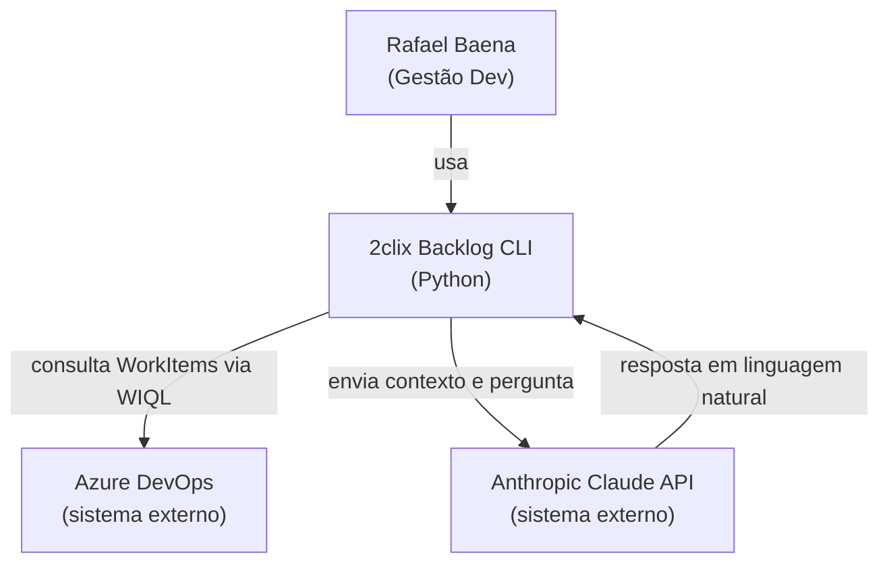
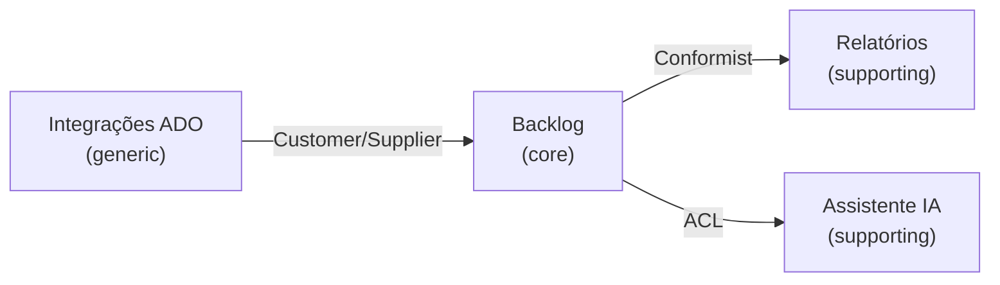

# Diagramas de Arquitetura

> Gerado/atualizado com a skill `/diagramar`. Mantenha **alto nível** — sem detalhe de implementação.

## Contexto do sistema (C4 L1)

## Containers (C4 L2)

> _A preencher via `/diagramar` após o kickoff._

## Mapa de bounded contexts (DDD)

